Spin up two(2) AWS ec2 Ubuntu instances to configure mysql server and mysql client.
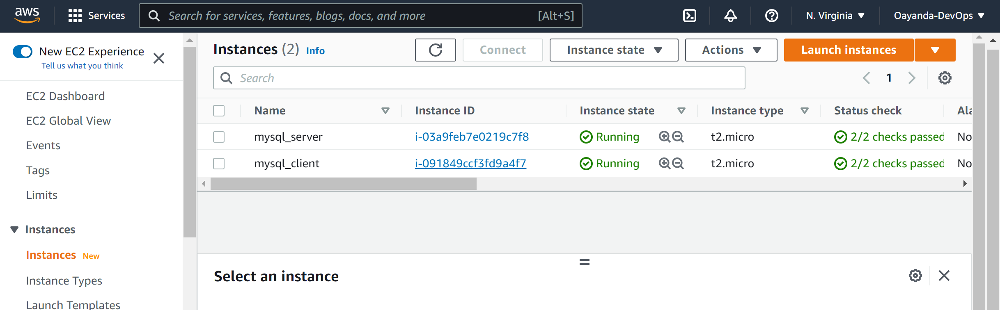

Login into the mysql server instance and update all packages and install mysql-server
```bash
sudo apt update -y sudo apt install mysql-server
```
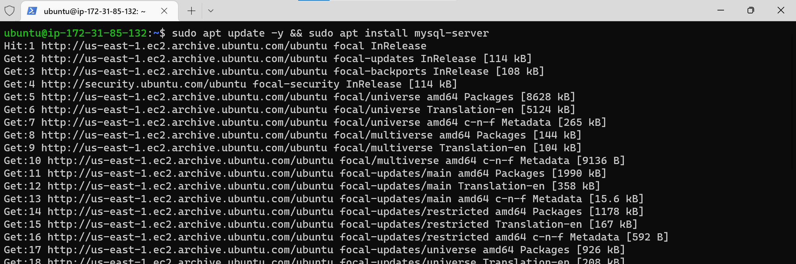

Login into the mysql client and update the packages and install mysql client.
```bash
sudo apt update sudo apt install mysql-client -y
```


Create inbound rule in the security group to open the default MySql port for the server and allow only the client server ip.
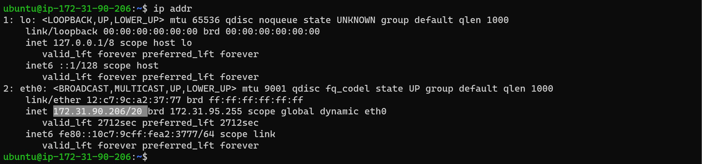
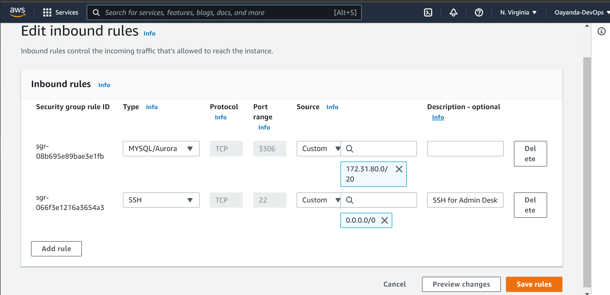

For ease of identification, set the hostnames for both instances. Exit and login back again to see the changes. 
```bash
sudo hostnamectl set-hostname mysql-server                  
```
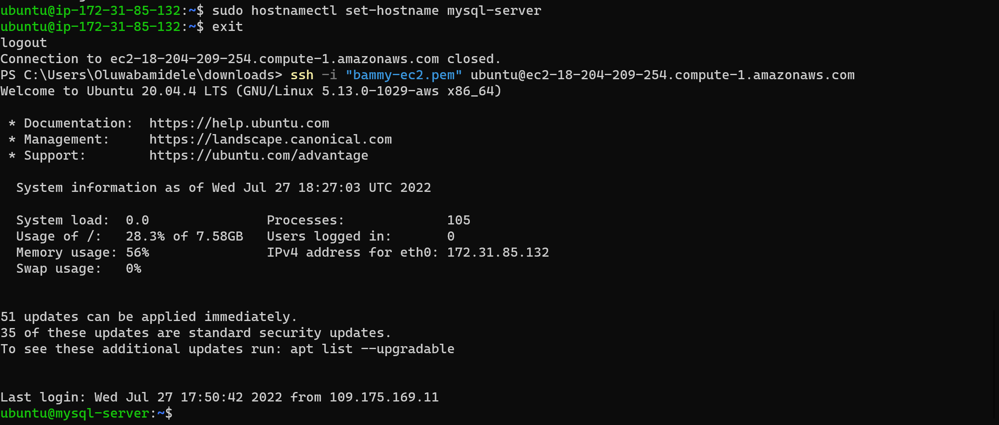
```bash
sudo hostnamectl set-hostname mysql-client                  
```
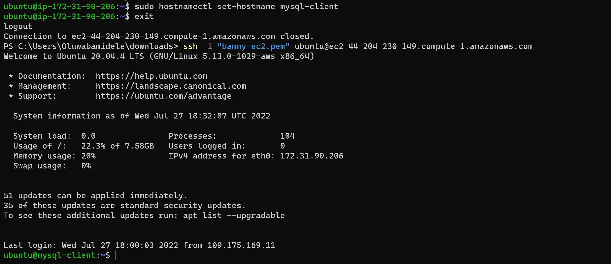

Set the Password for the root user.
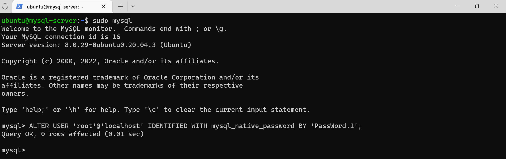

Delete unsecure default settings by using the mysl security script on the server.
```bash
mysql_secure_installation
```
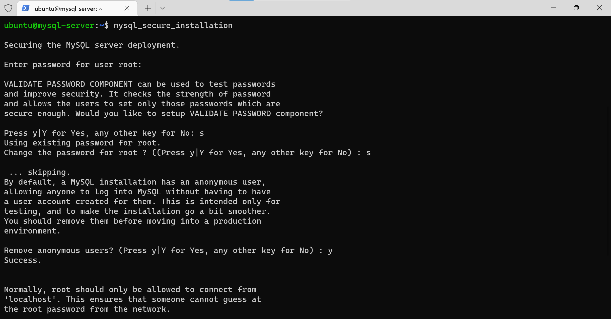

Create a user on mysql server.
```bash
CREATE USER 'client_user'@'%' IDENTIFIED WITH mysql_native_password BY 'PassWord.1';
```
Create a database and grant the created user access.
```bash
CREATE DATABASE testdb;
```
```bash
GRANT ALL ON testdb.* TO 'client_user'@'%';
```
Reloads the grant tables in the mysql database enabling the changes to take effect without reloading or restarting mysql service.
```bash
FLUSH PRIVILEDES;
```
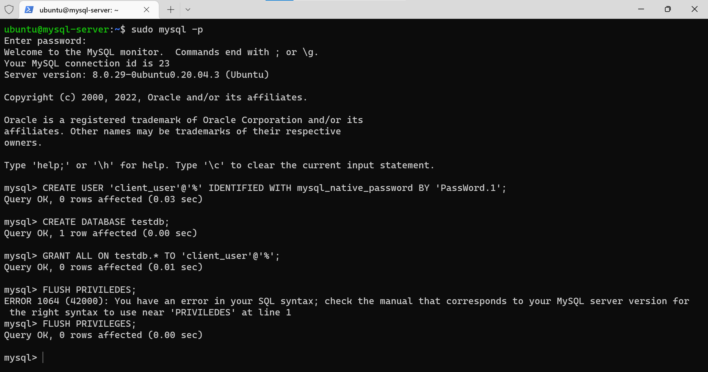

Change the bind address to 0.0.0.0 to allow connect from a remote host.
```bash
sudo nano /etc/mysql/mysql.conf.d/mysqld.cnf
```
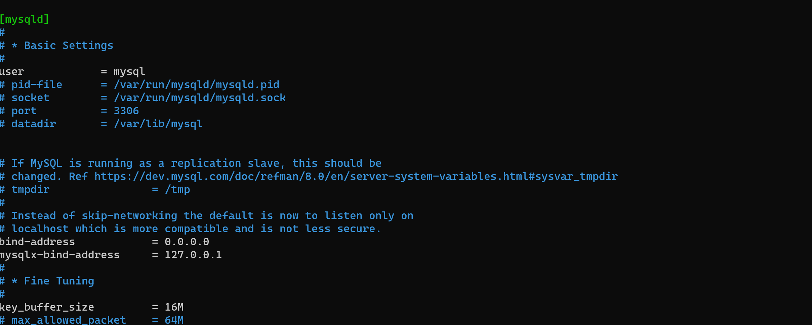
Restart the mqsl service.
```bash
sudo systemctl restart mysql
```
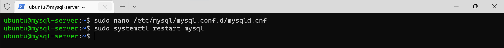

Test Connection
From the client instance, connect to the mysql server instance.
```bash
sudo mysql -u clent_user -h 172.31.85.132 -p
```
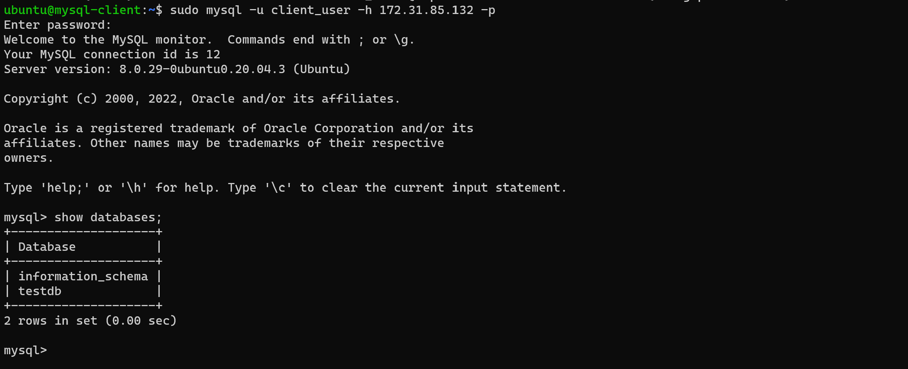